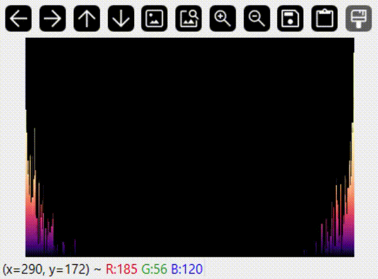

# MuVi

A simple application that visualizes the FFT of currently playing sounds in the system.


## Description

This is a two-person project aimed to improve C++ coding skills, including Boost, OpenCV and parallel processing.

## Goals

The current goal is to provide a one-window app running on Windows that will attach to the default output device and provide some visualization of Fourier transformation.

## Dependencies

Clone repository with:

```console
git clone https://github.com/Kosciany/MuVi.git
git submodule init
git submodule update
```

### MSYS2

1. Download msys2-x86_64-*.exe installer from [msys2.org](https://msys2.org) and proceed with default installation. Add msys64/mingw64/bin to PATH environmental variable (`C:\msys64\mingw64\bin` by default)
2. Launch MSYS2 console (`C:\msys64\msys2.exe` by default)
3. Install dependencies

    ```console
    pacman -S mingw-w64-x86_64-toolchain msys2-w32api-headers msys2-w32api-runtime mingw-w64-x86_64-cmake mingw-w64-x86_64-ninja mingw-w64-x86_64-boost mingw-w64-x86_64-spdlog mingw-w64-x86_64-opencv
    ```

4. Navigate to repository folder (PowerShell/CMD should work)
5. Build & run

    ```console
    cmake -G ninja
    ninja
    audiotest.exe
    ```

## Results

With following command:

````console
audiotest.exe --color 13 --width 300 --height 200
````

application should present following output with [this song](https://open.spotify.com/track/2YkIDPL5lGhRhomCq4S2RO?si=48a0516a252044bb).


